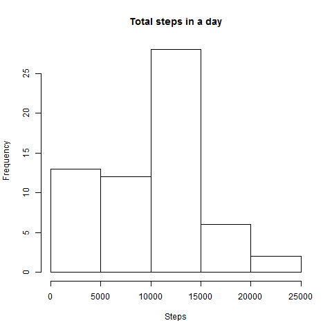
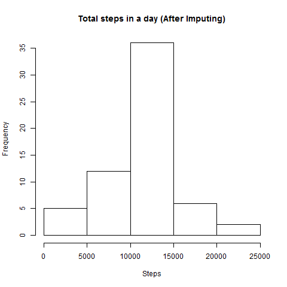

```{r setup, include=FALSE}
library(dplyr)
library(ggplot2)
library(lubridate)
myTbl <- read.csv("activity.csv", header = TRUE, na.strings = "NA", 
				colClasses = c("numeric", "factor", "numeric"))
knitr::opts_chunk$set(echo = TRUE)
```


# Introduction
This report analyses data recorded from a personal activity monitoring device from an anoynomous individual, collected during the period from October to November 2012. The data contained the number of steps taken in 5 minute intervals each day. The data for the analysis was downloaded from [here](https://d396qusza40orc.cloudfront.net/repdata%2Fdata%2Factivity.zip). The subsequent sections will outline the analysis performed.

## Note
The interval labels in the raw data were formatted in semi-proper form indicating the hour/min of the day (e.g. "5" represents 0005 while "1025" represents 10:25). These intervals were transformed into "correct" time values when time series plots referencing these intervals were generated.


# 1. Mean total steps per day
The steps taken within a day were summed up and the daily total placed in a vector. Missing values were ignored. The results were placed into a histogram.

```{r totalStepsAnalysis}
totalStepsByDay <- with(myTbl, tapply(steps, date, sum, na.rm = TRUE))
```

```{r totalStepsAnalysisPlot, echo = FALSE}
# hist(totalStepsByDay, xlab = "Steps", main = "Total steps in a day")
```
 


```{r summaryTotalSteps, echo = FALSE}
meanTotalStepsByDay <- mean(totalStepsByDay)
medTotalStepsByDay <- median(totalStepsByDay)
```
The mean and median total steps in a day were `r meanTotalStepsByDay` and `r medTotalStepsByDay` respectively. 

# 2. Average daily acitivity pattern
An average of steps taken for each interval over all the days was obtained. Missing values were again ignored. The time series was drawn in a line chart.

```{r meanStepsByInterval}
meanStepsByInterval <- with(myTbl, tapply(steps, interval, mean, na.rm = TRUE))
meanStepsByInterval <- data.frame(interval = as.numeric(names(meanStepsByInterval)), 
				steps = meanStepsByInterval)
```

```{r meanStepsByInterval2, echo = FALSE}
# timeProper <- sprintf("%04d00", meanStepsByInterval$interval) %>% 
# 			sapply(function(x) paste(c(substr(x, 1, 2), ":", 
# 				substr(x, 3, 4), ":", substr(x, 5, 6)), collapse = ""))
# timeProper <- as.Date("1970-01-01") + hms(timeProper)
# plot(timeProper, meanStepsByInterval$steps , type = "l", 
#      xlab = "Time of Interval", ylab = "Steps", 
#      main = "Steps in a 5 min. block within a day", xaxt = "n")
# axis.POSIXct(1, timeProper, format = "%H:%M")
```
 

```{r meanStepsByInterval3, echo = FALSE}
intervalWithLargestSteps <- with(meanStepsByInterval, interval[steps == max(steps)])
```
The interval with the largest steps is "`r intervalWithLargestSteps`".

# 3. Imputing missing values
```{r missingVal1, echo = FALSE}
numMissingValues <- sum(is.na(myTbl$steps))
```
There were a total of `r numMissingValues` missing values. These missing values were substituted with the average steps associated with their corresponding intervals. The steps taken within a day were again summed up and the daily total placed in a vector. The results were placed into a histogram.

```{r missingVal2}
imputedData <- merge(myTbl, meanStepsByInterval, by = "interval") %>%
	rename(steps = steps.x, meanStepsByInterval = steps.y)
imputedData$steps[is.na(imputedData$steps)] <- 
    imputedData$meanStepsByInterval[is.na(imputedData$steps)]
imputedData$meanStepsByInterval <- NULL
imputedData <- arrange(imputedData, date, interval)
totalStepsByDay <- with(imputedData, tapply(steps, date, sum))
```
```{r missingVal3, echo = FALSE}
# hist(totalStepsByDay, xlab = "Steps", 
# 	main = "Total steps in a day (After Imputing)")
```
 

```{r missingVal4, echo = FALSE}
meanTotalStepsByDay <- mean(totalStepsByDay)
medTotalStepsByDay <- median(totalStepsByDay)
```

The mean and median total steps in a day were `r meanTotalStepsByDay` and `r medTotalStepsByDay` respectively. With the imputing, both the mean and median increased, as expected. 

# 4. Activity difference between weekdays and weekends
The data with the imputed missing values was used here. The data was divided into weekday and weekend groups and the average of steps taken for each interval over all the days was obtained. The time series plots were drawn in a line chart.
```{r wkdayend1}
dayOfTheWeek <- weekdays(ymd(as.character(imputedData$date)))
dayType <- rep("weekday", nrow(imputedData))
dayType[dayOfTheWeek == "Sunday" | dayOfTheWeek == "Saturday"] <- "weekend"
dayType <- as.factor(dayType)
imputedData <- cbind(imputedData, dayType)
summarizedImputedData <- group_by(imputedData, dayType, interval) %>% 
						summarize(steps = mean(steps))
```
```{r wkdayend2, echo = FALSE, results = "hide"}
# timeProper <- sprintf("%04d00", summarizedImputedData$interval) %>% 
# 			sapply(function(x) paste(c(substr(x, 1, 2), ":", 
# 				substr(x, 3, 4), ":", substr(x, 5, 6)), collapse = "")) %>%
# 			as.POSIXct(format = "%H:%M:%S")
# qplot(timeProper, steps, data = summarizedImputedData, facets = dayType ~ .,
# 			geom = "line", main = "Steps in a 5 min. block within a day (after imputing)", 
# 			xlab = "Time of Interval") + scale_x_datetime(date_labels = "%H:%M") 
```
 