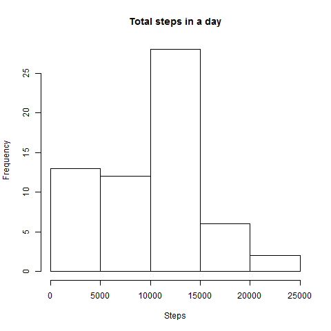
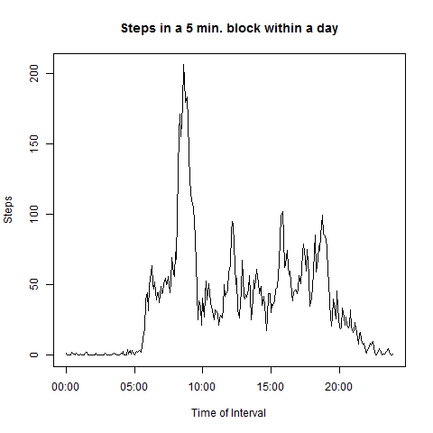
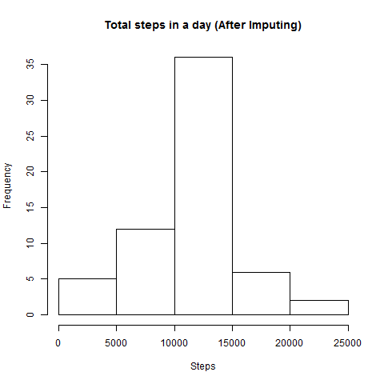
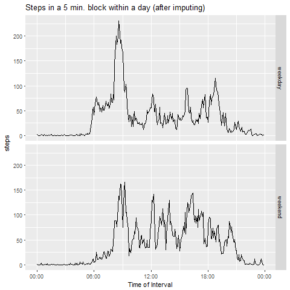

# Reproducible Research Week 2 Project
Yap Ching Loong Ian  
February 14, 2017  
 


# Introduction
This report analyses data recorded from a personal activity monitoring device from an anoynomous individual, collected during the period from October to November 2012. The data contained the number of steps taken in 5 minute intervals each day. The data for the analysis was downloaded from [here](https://d396qusza40orc.cloudfront.net/repdata%2Fdata%2Factivity.zip). The subsequent sections will outline the analysis performed.

## Note
The interval labels in the raw data were formatted in semi-proper form indicating the hour/min of the day (e.g. "5" represents 0005 while "1025" represents 10:25). These intervals were transformed into "correct" time values when time series plots referencing these intervals were generated.


# 1. Mean total steps per day
The steps taken within a day were summed up and the daily total placed in a vector. Missing values were ignored. The results were placed into a histogram.


```r
totalStepsByDay <- with(myTbl, tapply(steps, date, sum, na.rm = TRUE))
```


 


The mean and median total steps in a day were 9354.2295082 and 1.0395\times 10^{4} respectively. 

# 2. Average daily acitivity pattern
An average of steps taken for each interval over all the days was obtained. Missing values were again ignored. The time series was drawn in a line chart.


```r
meanStepsByInterval <- with(myTbl, tapply(steps, interval, mean, na.rm = TRUE))
meanStepsByInterval <- data.frame(interval = as.numeric(names(meanStepsByInterval)), 
				steps = meanStepsByInterval)
```


 


The interval with the largest steps is "835".

# 3. Imputing missing values

There were a total of 2304 missing values. These missing values were substituted with the average steps associated with their corresponding intervals. The steps taken within a day were again summed up and the daily total placed in a vector. The results were placed into a histogram.


```r
imputedData <- merge(myTbl, meanStepsByInterval, by = "interval") %>%
	rename(steps = steps.x, meanStepsByInterval = steps.y)
imputedData$steps[is.na(imputedData$steps)] <- 
    imputedData$meanStepsByInterval[is.na(imputedData$steps)]
imputedData$meanStepsByInterval <- NULL
imputedData <- arrange(imputedData, date, interval)
totalStepsByDay <- with(imputedData, tapply(steps, date, sum))
```

 


The mean and median total steps in a day were 1.0766189\times 10^{4} and 1.0766189\times 10^{4} respectively. With the imputing, both the mean and median increased, as expected. 

# 4. Activity difference between weekdays and weekends
The data with the imputed missing values was used here. The data was divided into weekday and weekend groups and the average of steps taken for each interval over all the days was obtained. The time series plots were drawn in a line chart.

```r
dayOfTheWeek <- weekdays(ymd(as.character(imputedData$date)))
dayType <- rep("weekday", nrow(imputedData))
dayType[dayOfTheWeek == "Sunday" | dayOfTheWeek == "Saturday"] <- "weekend"
dayType <- as.factor(dayType)
imputedData <- cbind(imputedData, dayType)
summarizedImputedData <- group_by(imputedData, dayType, interval) %>% 
						summarize(steps = mean(steps))
```

 
